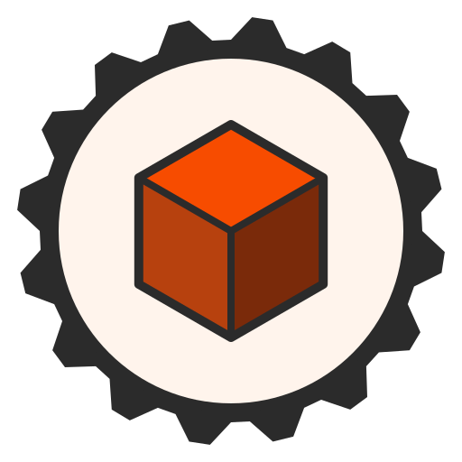
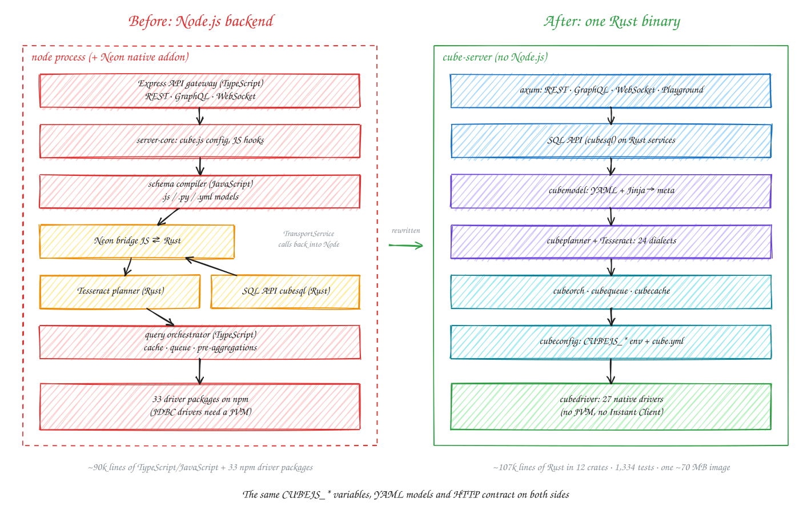
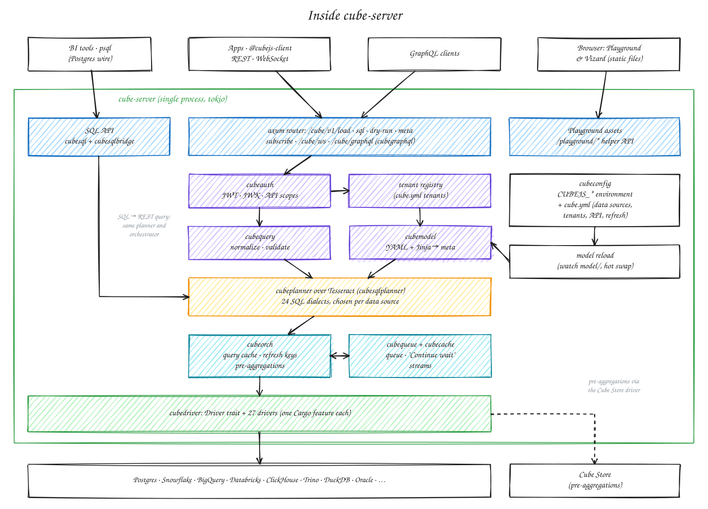
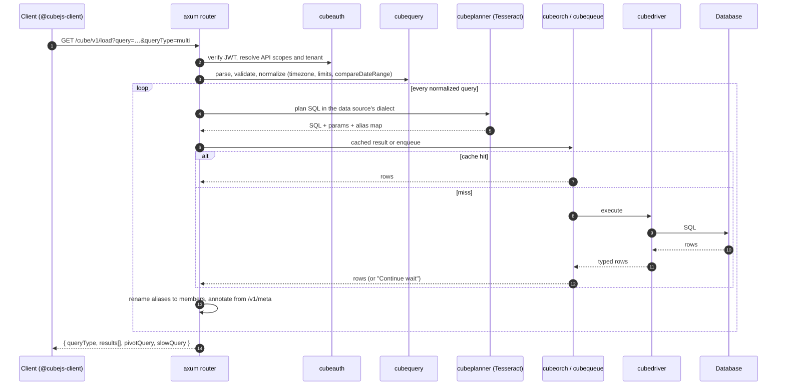
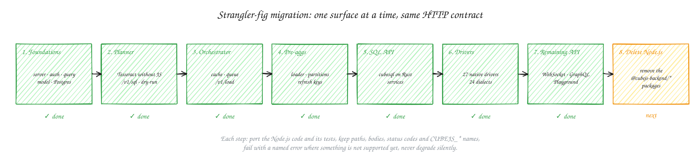
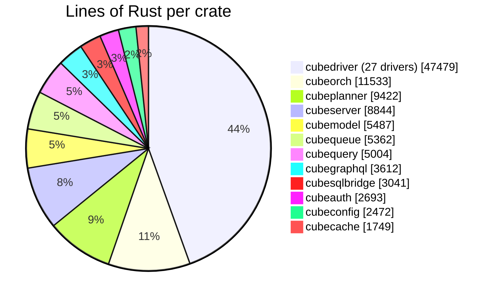

<p align="center">
  
</p>

<h1 align="center">Cube, rebuilt in Rust</h1>

<p align="center">
  <b>The Cube semantic layer as a single Rust binary, with no Node.js.</b><br/>
  REST · GraphQL · WebSocket · SQL (Postgres wire) · Playground in one process.
</p>

<p align="center">
  <a href="https://hub.docker.com/r/blockmill/cube"></a>
  
  
  
</p>

> **Community fork.** This repository is a fork of [cube-js/cube](https://github.com/cube-js/cube)
> and is not affiliated with or endorsed by Cube Dev, Inc. The upstream project is
> licensed under Apache-2.0 (backend) and MIT (client libraries); this fork keeps
> those licenses. Report problems with the Rust backend here, not upstream.

---

## What this fork is

[Cube Core](https://github.com/cube-js/cube) is an open-source semantic layer. You
define metrics, dimensions, joins and access rules once, then any BI tool, app or AI
agent can query them over SQL, REST or GraphQL. Upstream, the backend runs on
**Node.js**: an Express gateway, a JavaScript schema compiler and a TypeScript
query orchestrator, with Rust components loaded through a native addon.

This fork **replaces that whole backend with Rust**. The result is `cube-server`, one
binary that:

- **keeps the same HTTP contract as upstream**: the same endpoints, request and
  response bodies, status codes and error messages, so `@cubejs-client/*`, the
  Playground and BI tools work unchanged;
- **keeps the same `CUBEJS_*` environment variables and YAML data models**;
- **runs no Node.js, no JVM and no embedded JavaScript or Python engine**;
- **ships 27 native database drivers and 24 SQL dialects**;
- **comes as a ~70 MB multi-arch Docker image** that starts in milliseconds and
  uses about 55 MB of RAM on a small model.

<p align="center">
  
</p>

## Quick start

```bash
docker run -p 4000:4000 -p 15432:15432 \
  -e CUBEJS_DB_TYPE=postgres \
  -e CUBEJS_DB_HOST=db.example.com \
  -e CUBEJS_DB_NAME=analytics \
  -e CUBEJS_DB_USER=cube \
  -e CUBEJS_DB_PASS=secret \
  -e CUBEJS_API_SECRET=change-me \
  -e CUBEJS_DEV_MODE=true \
  -e CUBEJS_PG_SQL_PORT=15432 \
  -e CUBEJS_SQL_USER=cube -e CUBEJS_SQL_PASSWORD=cube \
  -v "$PWD":/cube/conf \
  blockmill/cube
```

Put your YAML data model in `./model` and open **http://localhost:4000**.

| Endpoint | Address |
|---|---|
| Playground (query builder, charts, code generation) | `http://localhost:4000/` |
| REST API | `http://localhost:4000/cube/v1/load`, `/sql`, `/dry-run`, `/meta` |
| GraphQL | `http://localhost:4000/cube/graphql` |
| WebSocket | `ws://localhost:4000/cube/ws` |
| SQL API | `psql -h localhost -p 15432 -U cube` |
| Health | `/readyz`, `/livez` |
| Drivers in this build | `http://localhost:4000/cube/v1/connectors` |

From source:

```bash
cd rust/cube
CUBEJS_DB_TYPE=postgres CUBEJS_DB_HOST=localhost CUBEJS_DB_NAME=analytics \
CUBEJS_API_SECRET=change-me CUBEJS_SCHEMA_PATH=/path/to/model \
cargo run --release -p cubeserver
```

> **Never expose development mode.** As upstream, `CUBEJS_DEV_MODE=true` is meant for
> a developer's machine. The Playground's helper routes (`/playground/*`) are not
> behind authentication, because the app fetches its API token from them.
> `cube-server` refuses to mount the Playground when `NODE_ENV=production`. Set a
> strong `CUBEJS_API_SECRET` and `CUBEJS_SQL_PASSWORD` for anything reachable from a
> network.

---

## Architecture

<p align="center">
  
</p>

Each box is a crate in [`rust/cube/`](rust/cube). Handlers depend only on service
traits, so every surface was ported and tested on its own.

| Crate | Replaces (upstream Node.js) | What it does |
|---|---|---|
| [`cubeserver`](rust/cube/cubeserver) | `@cubejs-backend/server`, the HTTP layer of `api-gateway` | axum router, auth middleware, CORS, WebSocket transport, Playground assets, `cube-server` binary |
| [`cubeauth`](rust/cube/cubeauth) | `checkAuth`, JWT/JWK, `contextToApiScopes` | HS/RS/ES JWT, `CUBEJS_API_SECRET(S)`, JWK URL cache with rotation, API scopes |
| [`cubequery`](rust/cube/cubequery) | `query.js`, `date-parser.js` | query parsing, validation and normalization, relative dates, `compareDateRange`, blending |
| [`cubemodel`](rust/cube/cubemodel) | schema compiler (loading and validation) | YAML + Jinja models, `extends`, views, hierarchies, folders, `/v1/meta` |
| [`cubeplanner`](rust/cube/cubeplanner) | `BaseQuery.js` and the dialect adapters | Tesseract without JavaScript callbacks; member-SQL parser (`{CUBE.x}`, `FILTER_PARAMS`, `SECURITY_CONTEXT`); 24 dialects |
| [`cubeorch`](rust/cube/cubeorch) | `QueryOrchestrator`, `QueryCache`, pre-aggregations | cache decision table, refresh keys, pre-aggregation loader, partitions, external builds |
| [`cubequeue`](rust/cube/cubequeue) | `QueryQueue` | execute, reconcile, heartbeat, cancellation, the "Continue wait" contract, streaming |
| [`cubecache`](rust/cube/cubecache) | `QueryCache` keys and cache drivers | `getCacheHash`, byte-compatible with Node (golden-tested against the JS code) |
| [`cubedriver`](rust/cube/cubedriver) | `base-driver` and 33 driver packages | `Driver` trait and 27 drivers, one Cargo feature each |
| [`cubegraphql`](rust/cube/cubegraphql) | `graphql.ts` | dynamic schema from the meta config, GraphiQL |
| [`cubesqlbridge`](rust/cube/cubesqlbridge) | the Neon `TransportService` | runs the SQL API (`cubesql`) on the Rust services |
| [`cubeconfig`](rust/cube/cubeconfig) | `cube.js` configuration | `CUBEJS_*` environment + declarative `cube.yml` (data sources, tenants, API, scheduled refresh) |

### Life of a `/v1/load` request



---

## How the migration was done

<p align="center">
  
</p>

The backend was replaced with a **strangler-fig** approach: one surface at a time,
with the Node.js server as the reference until the Rust one matched it.

1. **The Node.js code was the spec.** Each endpoint kept the exact contract of
   `packages/cubejs-api-gateway/src/gateway.ts`: paths, query parameters, bodies,
   error bodies `{ "error": "…" }`, status codes and `CUBEJS_*` names. The Node.js
   tests were ported with the code.
2. **Written specs came first for the hard parts.**
   [Orchestrator](rust/cube/docs/orchestrator-spec.md),
   [Tesseract evaluator](rust/cube/docs/tesseract-evaluator-spec.md) and
   [configuration](rust/cube/docs/config-migration.md) were each specified from the
   Node.js source before they were implemented.
3. **Anything unsupported fails loudly.** A feature that is not ported fails with an
   error that names it. It never quietly behaves differently. For example, an
   unknown database type used to be planned as Postgres; it is now refused at
   start-up.
4. **Everything was checked against real servers.** Drivers were tested against the
   databases themselves in Docker. Cache keys were golden-tested against the
   JavaScript implementation. The Playground was checked through the real
   `@cubejs-client/core` `ResultSet`.

Progress, decisions and known gaps are tracked in
[`rust/cube/MIGRATION.md`](rust/cube/MIGRATION.md).

### By the numbers

| | |
|---|---|
| Rust written for the backend | ~107k lines in 12 crates |
| Tests in those crates | 1,334 |
| Database drivers | 27 (all upstream types except `jdbc`) |
| SQL dialects | 24 |
| Docker image | ~70 MB compressed, `linux/amd64` + `linux/arm64`, distroless, non-root |



---

## Databases

Every upstream `CUBEJS_DB_TYPE` except `jdbc` has a native driver. Each driver is a
Cargo feature, and all of them are on by default.

| `CUBEJS_DB_TYPE` | Client | Verified against |
|---|---|---|
| `postgres`, `redshift` | tokio-postgres | Postgres |
| `mysql` | mysql_async | MySQL 8 |
| `mysqlauroraserverless` | AWS RDS Data API | local Data API (MySQL 5.7, 8.4) |
| `mssql` | tiberius (TDS, rustls) | SQL Server 2022 |
| `clickhouse` | HTTP | ClickHouse 24.8 |
| `bigquery`, `snowflake` | REST | — |
| `databricks-jdbc` | SQL Statement Execution API (no JVM) | mock server |
| `athena` | AWS SDK | mock + LocalStack S3 |
| `prestodb`, `trino` | HTTP (`nextUri`) | Presto 0.294, Trino 483 (incl. S3 unload) |
| `pinot` | HTTP broker | Pinot |
| `druid`, `firebolt` | HTTP SQL | — |
| `dremio` | REST | Dremio OSS |
| `hive` | Thrift HiveServer2 (also Spark Thrift) | Hive 4.0 |
| `vertica` | own wire client | Vertica 9.2 |
| `crate`, `materialize`, `questdb` | Postgres wire | CrateDB 6.4, Materialize v26, QuestDB 10 |
| `mongobi` | MySQL wire | mongosqld 2.14 + MongoDB 6 |
| `oracle` | `oracledb` thin (pure Rust, **no Instant Client**) | Oracle Free |
| `ksql` | REST + Kafka | ksqlDB 0.29 + Kafka + Cube Store |
| `sqlite`, `duckdb` | embedded engines | in-memory and file databases |
| `cubestore` | WebSocket | Cube Store |

`jdbc` is not available because it loads JDBC jars into a JVM. It fails at start-up
and names the native replacement to use instead.

---

## Differences from upstream Cube

| Upstream | This fork | Why |
|---|---|---|
| JavaScript, Python and YAML models | **YAML models only** (Jinja works) | No embedded JS/Python runtime. A `.js` model is rejected with an error naming the file. |
| `cube.js` / `cube.py` configuration with JS hooks | **Environment variables + `cube.yml`** | Hooks such as `contextToAppId`, `driverFactory` and `repositoryFactory` become declarative tenants and data sources. |
| API under `/cubejs-api` | **API under `/cube`** | Set `CUBEJS_BASE_PATH=/cubejs-api` to keep the old paths. |
| `CUBEJS_DB_TYPE=jdbc` | **Not available** | Needs a JVM. |
| Readiness probe tests only the default data source | **Tests every data source** | Upstream carries a `todo` for this. |
| Foreign-key introspection in the Postgres/MySQL drivers | **Fixed** | The Node.js query filters on the wrong side of the constraint and drops joins. |

Known gaps (each fails with a named error) are listed in
[`MIGRATION.md`](rust/cube/MIGRATION.md#known-gaps-in-priority-order). The main ones:
lambda rollups, export-bucket unload for BigQuery, Snowflake, Redshift and Databricks,
and some authentication modes (Redshift IAM, Kerberos, Snowflake password auth).

---

## Repository layout

| Path | Contents |
|---|---|
| [`rust/cube/`](rust/cube) | the Rust backend: `cube-server` and its crates |
| [`rust/cube/MIGRATION.md`](rust/cube/MIGRATION.md) | migration tracking: status per surface, decisions, known gaps |
| [`rust/cube/docs/`](rust/cube/docs) | design specs and [diagrams](rust/cube/docs/diagrams) (`.excalidraw` sources + generator) |
| [`rust/cube/docker/`](rust/cube/docker) | Dockerfile of the `blockmill/cube` image |
| [`rust/cubesql/`](rust/cubesql) | SQL API (Postgres wire), from upstream |
| [`packages/cubejs-client-*`](packages) | client libraries, unchanged |
| [`packages/cubejs-playground`](packages/cubejs-playground) | the Playground UI, served as static files |
| `packages/cubejs-*` (server, drivers, …) | the upstream Node.js backend, kept until the last migration step removes it |

### Building

```bash
cd rust/cube
cargo test -p cubeserver -p cubedriver -p cubeplanner -p cubeorch -p cubesqlbridge
cargo build --release -p cubeserver                                  # all 27 drivers
cargo build --release -p cubeserver --no-default-features \
  --features cubedriver/prestodb,cubedriver/trino                   # a slimmer build
```

The bundled DuckDB engine takes most of the build time. The Docker build is
described in [`rust/cube/docker/README.md`](rust/cube/docker/README.md).

The diagrams in this README are generated by
[`rust/cube/docs/diagrams/generate.mjs`](rust/cube/docs/diagrams/generate.mjs). Open
the `.excalidraw` files at [excalidraw.com](https://excalidraw.com) to edit them.

---

## About upstream Cube

Cube Core is developed by [Cube Dev](https://cube.dev). For concepts, data modeling
and the semantic layer itself, the upstream documentation applies to this fork too:

- [Documentation](https://docs.cube.dev) and [Getting Started](https://docs.cube.dev/cube-core/getting-started)
- [Data modeling reference](https://docs.cube.dev/reference/data-model)
- [Environment variables](https://docs.cube.dev/reference/configuration/environment-variables)
- [Upstream repository](https://github.com/cube-js/cube)

## License

Same as upstream: the backend is [Apache 2.0](./packages/cubejs-server/LICENSE) and
the client libraries are [MIT](./packages/cubejs-client-core/LICENSE). The diagrams
embed the [Virgil](https://github.com/excalidraw/virgil) font (SIL Open Font License 1.1).
